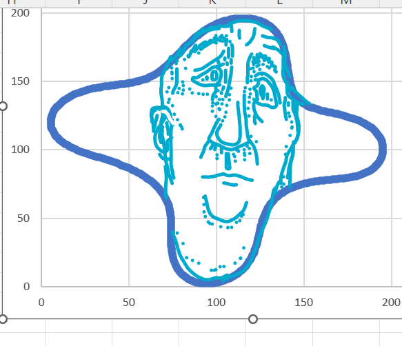
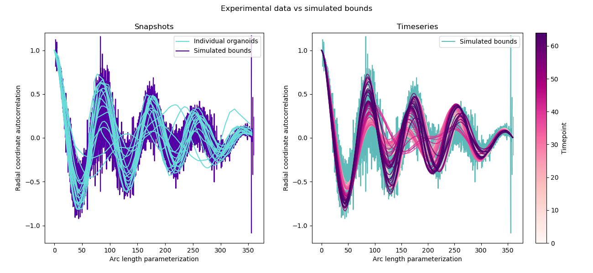

# Polar Autocorrelation

Welcome to the repo for my senior thesis! Polar autocorrelation is an algorithm that uses the autocorrelation function to
analyze the morphologies of intestinal organoids. For a much, much more detailed overview, read the document in the doc 
directory titled "this document does not yet exist."

## Tutorial

As you've surely read about in "this document does not yet exist," you can easily generate the stunning, curvaceous 
figures like the following:




The raw xy data are provided in the data directory, and all autocorrelation analysis is done in the course of figure generation.
There are individual shell scripts for each figure that can be run separately, but beware, figures three through five require 
the data generated by generate_fig2.sh. To keep it simple and run the entire project start to finish, run the following:

```
git clone (address)
cd Polar_Autocorrelation/src
bash run.sh
```

## Acknowlegements 

Thanks 'yall.